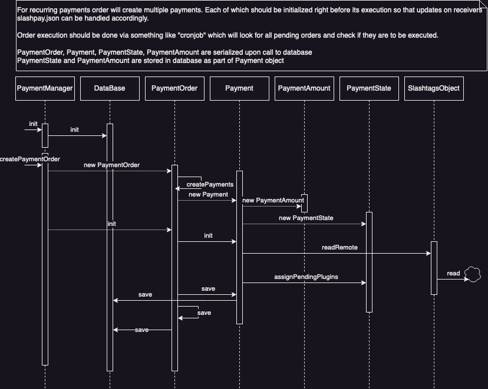
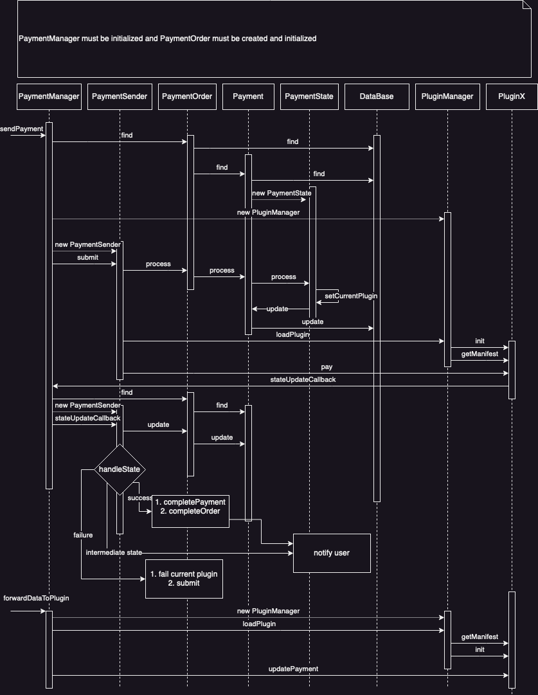

# Slashpay

## Description 
Slashpay abstracts and automates any payment method behind a single, static public key. The public key belongs to a [slashtag instance](https://github.com/synonymdev/slashtags/tree/master/packages/slashtag) and points to a data store containing all supported payment endpoints. Slashpay enables applications where users pay directly to profiles, so offers a very intuitive experience, particularly when multiple payment methods are possible within the system.  

Internally, Slashpay consists of the [core](#core) and [plugins](#plugins). See the [diagram](#collaboration-diagram) for more details on the internal system interactions.

## API
TODO: describe initialization etc after adding server and lib modes

```javascript
const notificationCallback = console.log
const slashpay = new Slashpay(notificationCallback)
const paymentOrder = await slashpay.createPaymentOrder({
  clientOrderId: '<unique id>'
  amount: '<sting amount, defaults to sats>'
  counterparyURL: '<slashtags url to the drive o to the slashpay json>'
})

await slashpay.sendPayment(paymentOrder.id)

const url = await slashpay.receivePayments()
// TODO: add more
```
## Core
The core consists of business logic and auxiliary classes. 

### Business logic classes
- `PaymentManager` - A facade class which exposes the business logic to the user and plugins
- `PaymentReceiver` - A class that enables the receiving of payments via registered plugins
- `PaymentSender` - A class that allows for the creation and sending of payments
- `PaymentOrder` - A class that creates an order for a single payment or a collection of payments in the case of subscriptions
- `PaymentObject` - A class that ensures the persistence of data in Slashtags drives and general local storage
- `PaymentAmount` - A class for abstracting currency and denomination specific logic
- `PaymentState` - A class responsible for the state management of payments
- `PluginManager` - A class for loading and communicating with plugins

### Auxilary classes
- `DatabaseConnector` - A pseudo ORM to connect with Sqlite storage for managing internal state
- `SlashtagsConnector` - A class for abstracting away CRUD operations over slashtags

## Plugins
All payment methods can be added through plugins. Any auxiliary logic can also be implemented via plugins. The general plugin requirements are as follows:
- They must be loadable with `require`
- They must implement the `async init()` method for plugin initialization
- They must implement the `async getmanifest()` method (see [manifest](#plugin-manifest))

### Plugin manifest
A JSON object returned via the `async getmanifest()` method. The returned JSON object must have the following keys:
- String `name` - A required unique name of the plugin within the scope of the slashpay instance
- String `type` - A value (so far the only supported type is `"payment"`)
- Optional array of strings `rpc` - Maps the name of the command to a function, see [rpc](#rpc-methods)
- Optional array of strings `events` - Maps the name of the command to a function, see [events](#events)

#### RPC methods
These are plugin methods to be called by core in a unicast manner.
- May implement the `stop()` method for graceful shutdown of the plugin
- Type `payment` requires implementation of the following method:
  - `pay(<payment object>, <callback>)` - Responsible for the invocation of logic for submitting a payment (see [payment](#payment) and [callback](#feedback-communication)).

#### Events
These are plugin methods to be called by core in a multicast manner. 
- `events` - An optional array of strings, various types of plugins require implementation of different RPC methods
- Type `payment` requires implementation of a "watch" event listener:
  - `receivePayments(payload)` - A method responsible for invocation of the logic for initializing the receiving of payments (see [receive payment payload](#payload) and [notification callback](#feedback-communication)).

#### Data objects

##### Payment
Payment is a JSON object with the following components. 
- `id` - A unique string to identity the payment
- `orderId` - A unique string to identify the corresponding payment order
- `counterpartyURL` - A URL string containing the slashtags key (if the path is not specified, the plugin should default to `/public/slashpay/<plugin name>/slashpay.json`)
- `memo` - A string specified by payee to serve as a reference
- `amount` - A string that specifies the amount in a given denomination
- `denomination` - A string that specificies the denomination of a specified amount (allowed values are either "BASE" or "MAIN")
- `currency` - A string of the currency code in ISO3166-1 Alpha3 format

##### Amount
- `amount` - A string that specifies the amount in a given denomination
- `denomination` - A string that specifies the denomination of the specified amount (allowed values are either "BASE" or "MAIN")
- `currency` - A string of the currency code in ISO3166-1 Alpha3 format

##### Payload:
- `id` - optional string id, used for payments for private slashtags;
- `amount` - optional string amount, used for payments with specified amount (private slashtgs);
- `notificationCallback` - feedback communication mechanism.

#### Feedback communication
Callback - A function which accepts a single parameter and is responsible for feedback communication.
Each call must include string property `pluginName`


The payload may contain the property `type` with the following string values:
- `payment_new` - This will (1) update the internal core's state if the payload is a valid payment object, and send a notification to the user. Properties are:
  - `pluginName` - string name of the plugin
  - `type` - `payment_new`
  - `rawData` - optional object which contains raw payment data
  - `amountSpecified` - boolean property used to signal if there was an expectation for specific amount of incoming payment
  - `currency` - currency of incoming payment (default BTC)
  - `denimination` - denomination of incoming payment (default BASE)
  - `clientOrderId` - global unique identifier of the payment
  - `amount` - payment amount of specified denomination and currency
  - `memo` - string payment payee defined description of payment

- `ready_to_receive` - mechanism to notify core that plugin is ready for receiving incoming payments. Properties are:
  - `pluginName` - plugin name
  - `type` - `ready_to_receive`
  - `data` - data to be stored in corresponding slashdrive file
  - `amountSpecified` - boolean property used to signal if there was an expectation for specific amount of incoming payment

- default - Forward to user. 
  - `pluginName` - plugin name
  - `pluginState` - optional field used to signal state of outgoing payment
    - `failed` - Marks the current plugin's attempt to make a payment as failed and asks the next plugin in the pipeline to process the payment
    - `success` - Marks the current payment as successfully completed by a plugin
    - default - Treats update as a intermediary state update which requires action from the user; the required action will be forwarded to user and their update will be forwarded to the plugin via invocation of the plugin's PRC method `updatePayment` with data
  - must include unique payment identifiers like `paymentId` and/or `orderId`

## Collaboration diagram

### Creating Payment
This diagram depicts the creation of a payment. 
<p align="center">
  </img>
</p>

### Sending Payment
This diagram which depicts the sending of a payment. 
<p align="center">
  </img>
</p>

### Receiving Payment
This diagram depicts the receipt of a payment. 
<p align="center">
  </img>
</p>

# Other resources

For more detailed information, please consult the following:
- [source code](./src/)
- [core unit tests](./test/payments/)
- [end-to-end tests](./test/e2e/)
- [examples](./examples/)
- [type definitions](./types/)
- [test fixtures](./test/fixtures)
